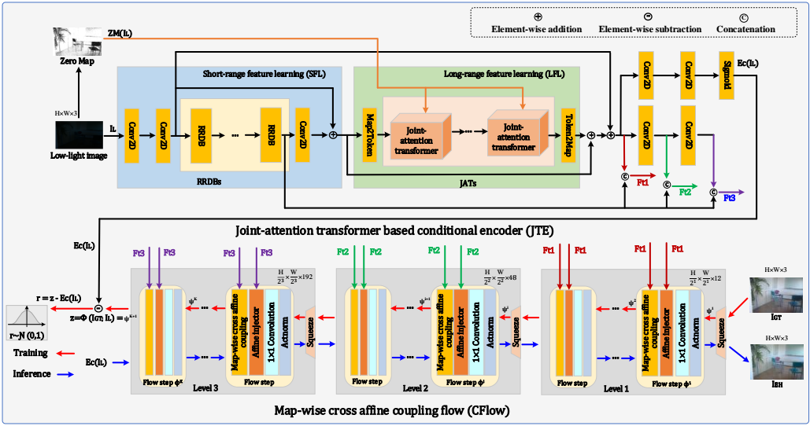
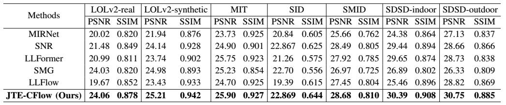
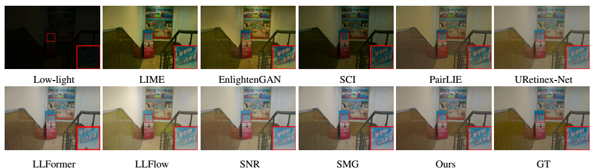

# JTE-CFlow for Low-light Image Enhancement


## Introduction
JTE-CFlow is a novel flow-based generative method for low-light image enhancement, which consists of a joint-attention transformer based conditional encoder (JTE) and a map-wise cross affine coupling flow (CFlow). **Experiments show that JTE-CFlow outperforms current SOTA methods on 7 mainstream low-light datasets with the same architecture**. 

### Overall Architecture


### Evaluation Metrics


### Visual Quality



## Dataset

- LOLv2 (Real & Synthetic): Please download the datasets via the following links [[Baiduyun (extracted code: l9xm)]](https://pan.baidu.com/s/1U9ePTfeLlnEbr5dtI1tm5g) [[Google Drive]](https://drive.google.com/file/d/1dzuLCk9_gE2bFF222n3-7GVUlSVHpMYC/view?usp=sharing).

- MIT: Please refer to [[MIRNet]](https://github.com/swz30/MIRNet).

- SID & SMID & SDSD (indoor & outdoor): Please refer to [[SNR]](https://github.com/dvlab-research/SNR-Aware-Low-Light-Enhance).


## Testing

### Pre-trained Models

Please download our pre-trained models via the following links.

### Run the testing code 

You can test the model with paired data and obtain the evaluation metrics. You need to specify the data path ```dataroot_LR```, ```dataroot_GT```, and model path ```model_path``` in the config file. Then run
```bash
python test.py
```


## Acknowledgments
Our code is based on [LLFlow](https://github.com/wyf0912/LLFlow), [SNR](https://github.com/dvlab-research/SNR-Aware-Low-Light-Enhance).

## Contact
If you have any questions, please feel free to contact the authors via [hynjupt@gmail.com](hynjupt@gmail.com).